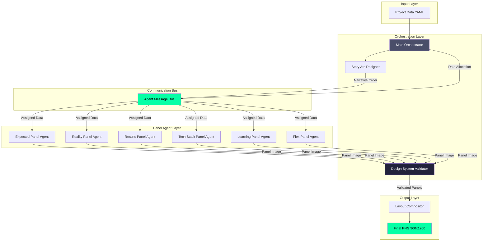

# Panel Agent Architecture
## Autonomous Panel Design System for Arkify

**Status:** Design Specification
**Created:** 2025-10-26
**Purpose:** Enable 6 independent agents to autonomously design panels within a unified 3x3 grid system

---

## Executive Summary

Current Arkify system has **hardcoded panels** in `layout_compositor_phase1.py`. Each panel (EXPECTED, REALITY, RESULTS, TECH STACK, LEARNED) is rigidly defined with fixed layouts.

**New Vision:** Each panel gets its own **autonomous Panel Agent** that can creatively design its content WITHIN strict constraints, ensuring visual harmony while enabling innovation.

---

## 1. Panel Agent Autonomy Model

### Autonomy Spectrum (0-100%)

| Aspect | Autonomy Level | Notes |
|--------|---------------|-------|
| **Layout structure** | 70% | Agent chooses arrangement WITHIN panel bounds |
| **Typography hierarchy** | 40% | Must use design system fonts, can choose sizes from allowed set |
| **Color palette** | 20% | Must use Future Dust palette, can choose emphasis colors |
| **Content selection** | 80% | Agent decides what data to show (from available data) |
| **Visual metaphors** | 90% | Agent creates unique visual representations (charts, diagrams, icons) |
| **Animation timing** | 60% | Agent defines animation, orchestrator coordinates overall timing |
| **Panel dimensions** | 0% | Fixed 300x400px (non-negotiable) |
| **Grid alignment** | 0% | Must follow 8px grid (non-negotiable) |

### Agent Decision Rights

**What Agents CAN Change:**
- Which metrics to emphasize (from available data)
- How to visualize data (bar chart vs line chart vs custom)
- Text positioning within panel (respecting 8px grid)
- Whether to use icons/emojis or pure text
- Level of detail (show 3 items vs 5 items)
- Background darkness (within allowed palette range)
- Animation style (pulse, slide, fade, etc.)

**What Agents CANNOT Change:**
- Panel size (300x400px fixed)
- Color palette (Future Dust only)
- Font family (Helvetica/system fonts)
- Grid system (8px alignment mandatory)
- Accessibility requirements (WCAG AA contrast)
- Output format (PNG generation)

---

## 2. Design System Contract

### The Sacred Rules (Violation = Rejection)

```yaml
DESIGN_SYSTEM_CONTRACT:
  version: "1.0"

  SPATIAL:
    panel_size: [300, 400]  # px (width, height)
    grid_unit: 8            # px (all spacing must be multiples)
    margin_min: 16          # px (2 grid units)
    margin_max: 32          # px (4 grid units)

  TYPOGRAPHY:
    font_family: "Helvetica"  # macOS system font
    font_sizes:
      - 18  # tiny
      - 24  # small / small_bold
      - 32  # medium
      - 48  # large
      - 72  # huge (only for header)
    line_height: 24         # px (3 grid units)

  COLOR:
    palette: "Future Dust 2025"
    allowed_colors:
      future_dust: "#4A4E69"       # Primary background
      electric_green: "#06FFA5"     # Accent (use sparingly!)
      cosmic_white: "#FFFFFF"       # Primary text
      deep_space: "#22223B"         # Darker background
      expected_grey: "#8B92A0"      # Muted elements
      text: "#FFFFFF"               # Alias for cosmic_white
      text_dim: "#C7C7C7"           # Secondary text
    contrast_requirement: "WCAG_AA"  # Minimum 4.5:1

  ACCESSIBILITY:
    contrast_ratio_min: 4.5
    font_size_min: 18
    touch_target_min: 44    # px (for interactive elements)

  VISUAL:
    corner_radius: [0, 4, 8]  # px (allowed values only)
    border_width: [0, 1, 2]   # px
    opacity: [0.0, 0.5, 0.7, 1.0]  # Allowed opacity levels
```

### Validation Checklist

Every Panel Agent output must pass:

1. **Spatial Validation**
   - [ ] Panel dimensions exactly 300x400px
   - [ ] All spacing multiples of 8px
   - [ ] Margins between 16-32px

2. **Typography Validation**
   - [ ] Only approved font sizes used
   - [ ] Line heights follow 24px rhythm
   - [ ] Text readable at 2ft distance (mobile test)

3. **Color Validation**
   - [ ] Only Future Dust palette colors
   - [ ] All text passes WCAG AA contrast (4.5:1+)
   - [ ] Electric green used <20% of panel (accent only)

4. **Content Validation**
   - [ ] No text truncation mid-word
   - [ ] No overlapping elements
   - [ ] All data sourced from input YAML (no mock data)

5. **Accessibility Validation**
   - [ ] Color contrast verified programmatically
   - [ ] Alt text provided for visual elements
   - [ ] Works with reduced motion preference

---

## 3. Panel Agent Roster

### Agent 1: Expected Panel Agent
**Responsibility:** Show project expectations/estimates

**Data Sources:**
- `expectations.timeline`
- `expectations.cost`
- `expectations.challenges[]`

**Autonomy Decisions:**
- How many challenges to show (2-5)
- Whether to show cost as primary or secondary metric
- Text emphasis (bold timeline vs dim timeline)

**Signature Style:**
- Muted grey tones (`expected_grey`)
- Understated typography
- "Before" feeling

### Agent 2: Reality Panel Agent
**Responsibility:** Show actual project outcomes (contrast with expected)

**Data Sources:**
- `reality.timeline`
- `reality.cost`
- `reality.surprises[]`
- `reality.challenges[]`

**Autonomy Decisions:**
- Which surprises to highlight (top 2-4)
- Bar visualization size/position
- Mic drop moment placement

**Signature Style:**
- Electric green accent (`electric_green`)
- Bold typography
- Visual punch (bar, border, etc.)

### Agent 3: Results Panel Agent
**Responsibility:** Show project metrics/outcomes

**Data Sources:**
- `results.users` OR `results.commits` OR `results.files_created`
- `results.revenue` OR `results.lines_of_code`
- `results.week_one`, `results.week_four` (growth trajectory)

**Autonomy Decisions:**
- Which metric to emphasize (biggest number? most impressive?)
- How to show growth (percentage vs absolute)
- Secondary vs tertiary metric priority

**Signature Style:**
- Big numbers (48-72px)
- Electric green for primary metric
- White for secondary metrics

### Agent 4: Tech Stack Panel Agent
**Responsibility:** Show technologies used

**Data Sources:**
- `tech_stack[]` (list of tool names)
- `icons[]` (fetched SVG paths)

**Autonomy Decisions:**
- Icon layout (2x2 grid vs vertical list vs horizontal)
- Icon size (40-80px range)
- Whether to show labels below icons or on hover

**Signature Style:**
- Icon-centric design
- Minimal text
- Brand color extraction from logos

### Agent 5: Learning Panel Agent
**Responsibility:** Show key insights/lessons

**Data Sources:**
- `learning` (primary insight)
- `reality.challenges[]` (what was hard)

**Autonomy Decisions:**
- How much of learning text to show
- Whether to include reality challenges
- Emphasis placement (quote marks? highlight?)

**Signature Style:**
- Lighter background (`future_dust`)
- White text for contrast
- Thought-provoking layout

### Agent 6: Flex Panel Agent (TBD)
**Responsibility:** Wildcard - agent decides what's most valuable

**Data Sources:**
- ALL available data

**Autonomy Decisions:**
- What to visualize (cost breakdown? timeline? diagram?)
- Visual treatment
- Content priority

**Signature Style:**
- Surprise element
- Innovation zone
- A/B testable

---

## 4. Agent Communication Protocol

### Message Format

```python
PanelAgentMessage = {
    "agent_id": str,           # e.g., "reality_panel_agent"
    "panel_position": tuple,   # (col, row) e.g., (1, 2)
    "data_requested": list,    # e.g., ["reality.timeline", "reality.cost"]
    "data_consumed": dict,     # Actual data used (for dedup)
    "visual_weight": float,    # 0.0-1.0 (how much attention panel demands)
    "color_emphasis": str,     # Primary color used
    "animation_intent": str,   # "pulse" | "slide" | "none" | "custom"
    "render_output": Image,    # PIL Image object (300x400px)
    "metadata": dict           # Debug info, design decisions
}
```

### Communication Phases

#### Phase 1: Data Negotiation (Before Rendering)
Agents declare what data they WANT to use.

```python
# Example: Reality Panel Agent
{
    "phase": "negotiation",
    "agent_id": "reality_panel_agent",
    "data_requested": [
        "reality.timeline",
        "reality.cost",
        "reality.surprises"
    ],
    "priority": 8  # 1-10 scale
}
```

**Orchestrator** checks for conflicts:
- Did two agents request same data?
- Is requested data available in input YAML?
- Is panel assignment optimal?

#### Phase 2: Rendering (Parallel Execution)
Agents render their panels independently.

```python
# Each agent receives:
{
    "phase": "render",
    "agent_id": "reality_panel_agent",
    "assigned_data": {
        "reality": {
            "timeline": "5 days + 2 debug days",
            "cost": 37,
            "surprises": ["AI struggled with edge cases", "Styling took 3x longer"]
        }
    },
    "panel_position": (1, 2),  # Column 1, Row 2
    "design_system": DESIGN_SYSTEM_CONTRACT,
    "neighbor_agents": ["expected_panel_agent", "learning_panel_agent"]  # For context
}
```

#### Phase 3: Validation (Quality Gate)
Orchestrator validates output.

```python
validation_result = {
    "passed": bool,
    "violations": [
        {"rule": "panel_size", "expected": [300, 400], "actual": [300, 420]},
        {"rule": "color_contrast", "expected": 4.5, "actual": 3.2}
    ],
    "warnings": [
        {"type": "text_truncation", "location": "line 3"}
    ]
}
```

If validation fails → Agent regenerates with feedback.

#### Phase 4: Assembly (Orchestrator)
All panels composited into 3x3 grid.

```python
final_layout = {
    "canvas": Image(900, 1200),
    "panels": {
        (0, 0): header_panel,      # Spans 3 columns
        (0, 1): expected_panel,
        (1, 1): reality_panel,
        (2, 1): results_panel,
        (0, 2): tech_stack_panel,
        (1, 2): learning_panel,
        (2, 2): flex_panel
    }
}
```

---

## 5. Coordination Strategy

### Problem: 6 Agents = Potential Chaos

**Without coordination:**
- All panels use electric green → visual noise
- Same data shown multiple times
- Conflicting visual styles
- No narrative flow

**Solution: Orchestrated Autonomy**

### Rule 1: Visual Weight Budget
**Total visual weight across all panels must = 3.0**

```python
VISUAL_WEIGHT_BUDGET = {
    "header": 1.0,          # Always maximum (it's the hook)
    "panel_slots": 2.0      # Distributed across 6 panels
}

# Example distribution:
{
    "expected": 0.2,   # Muted
    "reality": 0.6,    # HIGH IMPACT (bar, electric green)
    "results": 0.5,    # Big numbers
    "tech_stack": 0.3, # Icons (moderate)
    "learning": 0.4,   # Thought-provoking
    "flex": 0.0        # Wildcard (can negotiate)
}
```

**Enforcement:**
- Orchestrator assigns initial weights
- Agents can REQUEST higher weight (with justification)
- Total never exceeds 2.0

### Rule 2: Color Coordination
**Maximum 2 panels can use electric green as primary accent**

```python
COLOR_COORDINATION = {
    "electric_green_slots": 2,  # Max panels with green accent
    "assignments": {
        "reality_panel": "electric_green",  # Primary user
        "results_panel": "electric_green",  # Secondary user
        "others": "future_dust" or "cosmic_white"
    }
}
```

### Rule 3: Data Deduplication
**Each data point shown ONCE (no redundancy)**

```python
# Orchestrator tracks data usage
data_registry = {
    "reality.timeline": "reality_panel",
    "reality.cost": "reality_panel",
    "reality.surprises": "reality_panel",
    "results.users": "results_panel",
    "tech_stack": "tech_stack_panel",
    "learning": "learning_panel"
}

# If agent requests already-used data:
if requested_data in data_registry:
    return {"status": "conflict", "owned_by": data_registry[requested_data]}
```

### Rule 4: Narrative Flow
**Story Arc Designer defines reading order**

```python
READING_ORDER = [
    "header",        # Hook
    "results",       # Social proof
    "tech_stack",    # How?
    "expected",      # Setup
    "reality",       # Payoff
    "learning"       # Wisdom
]
```

Agents receive their position in narrative:
```python
{
    "narrative_position": 4,  # 4th panel in story
    "narrative_role": "payoff",  # This is the twist/reveal
    "previous_panel": "expected",  # What came before
    "next_panel": "learning"       # What comes after
}
```

Agents adjust content based on role:
- **Setup panels** (expected): Understated, muted
- **Payoff panels** (reality): Bold, high contrast
- **Wisdom panels** (learning): Reflective, lighter tone

---

## 6. Innovation Zones

### Where Agents CAN Experiment

#### Zone 1: Visual Metaphors
Agents can create custom visualizations:
- **Expected Panel:** Could use clock icon for timeline
- **Reality Panel:** Could use lightning bolt for surprise
- **Results Panel:** Could use growth arrow for trajectory
- **Tech Stack Panel:** Could arrange icons in tool chain flow
- **Learning Panel:** Could use lightbulb or quote marks

**Constraint:** Must still pass design system validation.

#### Zone 2: Information Density
Agents decide detail level:
- Show 2 challenges or 5?
- Display percentage change or absolute numbers?
- Include tertiary metrics or keep minimal?

**Constraint:** Must fit in 300x400px without truncation.

#### Zone 3: Typographic Rhythm
Agents can vary text sizes (from allowed set):
```python
# Example: Results Panel choosing emphasis
primary_metric: 72px   # HUGE
secondary_metric: 48px  # LARGE
tertiary_metric: 24px   # SMALL

# vs alternative (more balanced):
primary_metric: 48px
secondary_metric: 32px
tertiary_metric: 24px
```

**Constraint:** All sizes from approved list [18, 24, 32, 48, 72].

#### Zone 4: Animation Choreography
Agents design panel-specific animations:
- **Tech Stack:** Icons fade in sequentially
- **Results:** Numbers count up
- **Reality:** Bar slides in from left
- **Expected:** Subtle pulse on timeline

**Constraint:** Animation duration 0.5-2s, orchestrator controls overall sequence.

#### Zone 5: Adaptive Layouts
Agents respond to data availability:
```python
# If reality.surprises has 5 items → compact list
# If reality.surprises has 1 item → large emphasis

# If tech_stack has 4 items → 2x2 grid
# If tech_stack has 6 items → 2x3 grid or scrollable
```

**Constraint:** Must gracefully handle 0 items (show placeholder or hide section).

---

## 7. Architecture Diagram



---

## 8. Implementation Roadmap

### Phase 1: Foundation (Week 1)
- [ ] Create `PanelAgent` base class
- [ ] Implement Design System Validator
- [ ] Build Agent Message Bus
- [ ] Create one reference Panel Agent (Reality Panel)

### Phase 2: Core Agents (Week 2)
- [ ] Implement all 6 Panel Agents
- [ ] Build Data Negotiation protocol
- [ ] Add Visual Weight Budget enforcement
- [ ] Test with example YAML files

### Phase 3: Coordination (Week 3)
- [ ] Implement Color Coordination rules
- [ ] Add Data Deduplication tracking
- [ ] Integrate Story Arc Designer feedback
- [ ] Build validation pipeline

### Phase 4: Innovation (Week 4)
- [ ] Enable Visual Metaphor experimentation
- [ ] Add Adaptive Layout logic
- [ ] Implement Animation Choreography
- [ ] A/B test different agent strategies

### Phase 5: Quality (Week 5)
- [ ] Visual regression testing
- [ ] Accessibility audit
- [ ] Performance optimization
- [ ] Documentation complete

---

## 9. Success Metrics

### Agent Performance
- **Autonomy Score:** % of design decisions made by agent vs hardcoded
  - Target: >70%
- **Validation Pass Rate:** % of first renders that pass design system checks
  - Target: >90%
- **Data Efficiency:** % of available data utilized
  - Target: >80%

### System Performance
- **Generation Time:** Total time to render all 6 panels
  - Target: <5 seconds
- **Visual Consistency:** Human evaluation of harmony across panels
  - Target: 9/10 reviewers rate as "cohesive"
- **Innovation Index:** # of unique visual treatments per 10 generations
  - Target: >15 (agents trying different approaches)

### Content Quality
- **No Redundancy:** % of breakdowns with zero duplicate data
  - Target: 100%
- **Narrative Flow:** Story Arc coherence rating
  - Target: >8/10
- **Accessibility:** WCAG AA compliance
  - Target: 100%

---

## 10. Example Agent Interaction

### Scenario: Generating Breakdown for "AI Todo App"

**Step 1: Orchestrator Assigns Data**
```python
orchestrator.assign_data({
    "expected_panel": {
        "timeline": "2-3 days",
        "cost": 50,
        "challenges": ["Supabase auth", "UI design"]
    },
    "reality_panel": {
        "timeline": "5 days + 2 debug days",
        "cost": 37,
        "surprises": ["AI struggled with edge cases", "Styling took 3x longer"]
    },
    "results_panel": {
        "users": 127,
        "revenue": 0,
        "week_one": 89,
        "week_four": 127
    }
    # ... etc
})
```

**Step 2: Agents Negotiate**
```python
# Reality Panel requests high visual weight
reality_agent.request({
    "visual_weight": 0.7,  # HIGH (because timeline surprise is the hook)
    "color_emphasis": "electric_green",
    "justification": "Timeline surprise is core insight"
})

# Orchestrator approves (fits budget)
orchestrator.approve(reality_agent, visual_weight=0.6)  # Slightly reduced
```

**Step 3: Parallel Rendering**
All 6 agents render simultaneously (2-3 seconds).

**Step 4: Validation**
```python
# Reality Panel output checked
validator.check(reality_panel_output)
# ✅ Panel size: 300x400px
# ✅ Grid alignment: All 8px
# ✅ Color contrast: 7.2:1 (exceeds 4.5:1)
# ✅ No text truncation
# PASS
```

**Step 5: Assembly**
Compositor assembles 3x3 grid, saves PNG.

**Output:** `ai-todo-app-phase1.png` (900x1200px, <1MB)

---

## 11. FAQ

**Q: What if an agent wants MORE than 300x400px?**
A: Denied. Panel size is non-negotiable. Agent must adapt content to fit.

**Q: Can agents create sub-panels?**
A: Yes! Agents can subdivide their 300x400px space however they want (respecting 8px grid).

**Q: What if two agents want the same data?**
A: Orchestrator assigns based on narrative priority. Agent with higher story arc position wins.

**Q: Can agents communicate with each other directly?**
A: No. All communication through Message Bus (orchestrator mediates).

**Q: What if validation fails?**
A: Agent gets ONE retry with specific feedback. If still fails → fallback to simple layout.

**Q: Can users override agent decisions?**
A: Future feature. Phase 1 = full agent autonomy. Phase 2+ = user can provide "hints" in YAML.

**Q: How do we prevent 6 wildly different styles?**
A: Design System Contract enforces consistency. Agents have creative freedom WITHIN strict boundaries.

---

## 12. Next Steps

1. **Review this specification** with team
2. **Create `PanelAgent` base class** in `/agents/panel_agent_base.py`
3. **Implement one reference agent** (Reality Panel suggested)
4. **Build Message Bus** for agent communication
5. **Test with existing YAML examples**

---

**Document Version:** 1.0
**Last Updated:** 2025-10-26
**Status:** Specification Complete, Implementation Pending
